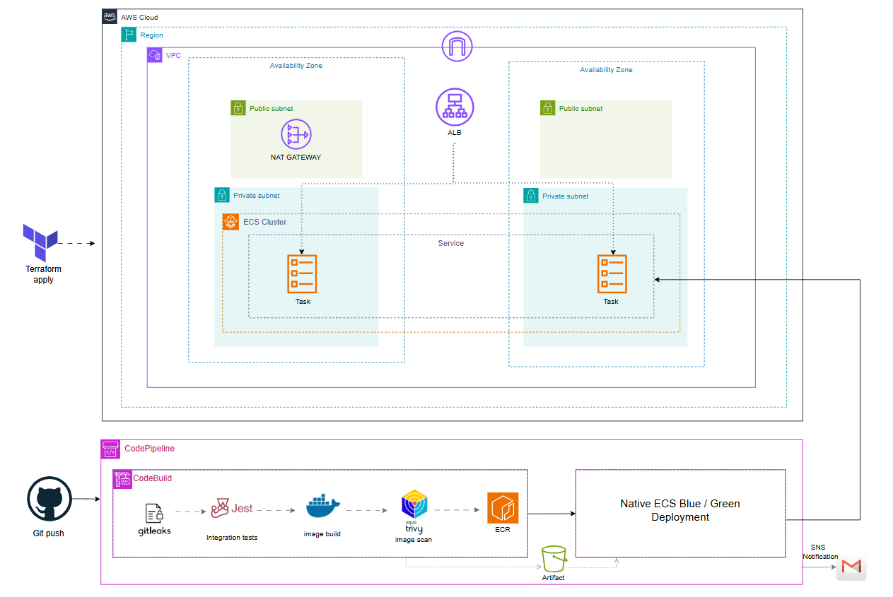

# Blue/Green CI/CD Pipeline on AWS ECS Fargate

Fully Terraform-managed CI/CD pipeline that builds, scans, and deploys a containerized Node.js/Express application to **AWS ECS Fargate** using **ECS-native Blue/Green deployments** — no CodeDeploy, no `appspec.yaml`.

Built as a 2-month Cloud & DevOps internship project (Smartovate LTD, remote). Infrastructure, pipeline, and security tooling are 100% defined as code.

---

## Architecture




Pipeline state changes (`SUCCEEDED` / `FAILED`) are pushed via **EventBridge → SNS → email**, with a human-readable message via `input_transformer` (no raw JSON).

---

## Tech stack

| Layer | Tools |
|---|---|
| IaC | Terraform ≥ 1.11, AWS provider `~> 6.4` |
| Compute | ECS Fargate, Application Load Balancer |
| CI/CD | CodePipeline, CodeBuild, CodeStar Connections |
| Container registry | ECR (scan-on-push, immutable tags) |
| Security scanning | Gitleaks (secrets), Trivy (image CVEs) |
| Notifications | EventBridge, SNS |
| Application | Node.js / Express, Jest + Supertest |
| State management | S3 backend, native `use_lockfile`  |

---

## Repository structure

```
.
├── app/              # Node.js/Express application + Jest tests
├── infra/            # Terraform 
│   ├── modules/
│   │   ├── vpc/      # VPC, public/private subnets, NAT, IGW
│   │   ├── ecr/      # Container registry
│   │   ├── s3/       # Pipeline artifact bucket
│   │   ├── iam/      # All IAM roles/policies for the project
│   │   ├── alb/      # ALB, target groups, listener + weighted rule
│   │   ├── ecs/      # Cluster, task definition, Blue/Green service
│   │   ├── cicd/      # CodeStar connection, CodeBuild, CodePipeline
│   │   └── sns/      # Topic, email subscription, EventBridge rule
│   └── main.tf
└── bootstrap-infra/  # One-time bootstrap for the Terraform state bucket
```

Each module is split by responsibility into separate `.tf` files (e.g. `codebuild.tf`, `codepipeline.tf`) rather than one monolithic file.

---

## Key architectural decisions

**ECS-native Blue/Green over CodeDeploy.**
Available since July 2025, AWS-recommended. Removes the need for `appspec.yaml` and a separate CodeDeploy application/deployment group. Controlled entirely through `deployment_controller.type = "ECS"` and `deployment_configuration.strategy = "BLUE_GREEN"` on the `aws_ecs_service` resource.


**Terraform bootstraps, CodePipeline takes over.**
Terraform creates the Task Definition once (revision 1) to enable the first deploy. Every subsequent revision is handled by CodePipeline's standard `ECS` deploy action, which only needs `imagedefinitions.json` .

**Drift is intentional, and scoped.**
Three `lifecycle { ignore_changes }` blocks, each added only once the corresponding mechanism went live:
- `aws_lb_listener.http` → ignores `default_action`
- `aws_lb_listener_rule.production` → ignores `action` (weights change per deploy)
- `aws_ecs_service.app` → ignores `task_definition`, `load_balancer`

**IAM least-privilege audit.**
Wildcard `Resource = "*"` statements replaced with scoped ARNs wherever AWS technically allows it.

---

## Getting started

**Prerequisites:** Terraform ≥ 1.11, AWS CLI configured, an AWS account, a GitHub repo connected via CodeStar Connections.

```bash
# 1. Bootstrap the remote state bucket (one-time, local state)
cd bootstrap-infra
terraform init
terraform apply

# 2. Deploy the infrastructure
cd ../infra
terraform init -backend-config=backend.hcl
terraform plan
terraform apply
```

`backend.hcl` is gitignored — it contains the state bucket name and account id etc .


## Security

- **Secret scanning:** Gitleaks runs on every CI build; a full local scan of the entire git history has also been run and confirmed clean.
- **Image scanning:** Trivy blocks the pipeline on HIGH/CRITICAL CVEs (`--exit-code 1 --severity HIGH,CRITICAL --ignore-unfixed`).
- **State security:** Terraform state lives in a versioned, encrypted S3 bucket with native locking (`use_lockfile`); the bucket name/account ID never appear in committed code.


---

## Author

Hicham El Hanafi — Cloud & Devops engineering student